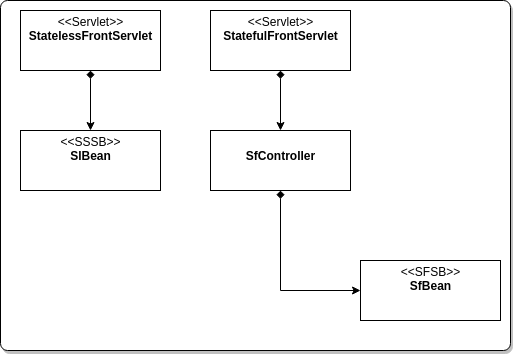

## Exercício 2

Utilize um projeto [multimódulo](https://maven.apache.org/guides/getting-started/index.html#How_do_I_build_more_than_one_project_at_once) para construir uma aplicação Java EE. 
A aplicação deverá conter dois sessions beans, um stateless e outro stateful, que utilizem as anotações
de ciclo de vida para ecoar no console quando os mesmos foram criados ou destruídos (ver figura 
abaixo).



### Pontos importantes

**1. Criar o projeto multi-módulo**

Você pode utilizar o arquétipo quickstart do Maven e editar o `pom.xml` criado ou então utilizar
algum arquétipo adequado para projetos multi-módulos.

```
mvn -B archetype:generate -DarchetypeGroupId=org.codehaus.mojo.archetypes -DarchetypeArtifactId=pom-root -DarchetypeVersion=RELEASE -DgroupId=uni7 -DartifactId=project
```

**2. Crie os sub-projetos necessários**

Será necessário um projeto para cada camada e um para a aplicação.

```
mvn -B archetype:generate -DarchetypeGroupId=org.apache.maven.archetypes -DgroupId=uni7.web -DartifactId=web
```

```
mvn -B archetype:generate -DarchetypeGroupId=org.apache.maven.archetypes -DgroupId=uni7.biz -DartifactId=biz
```

```
mvn -B archetype:generate -DarchetypeGroupId=org.apache.maven.archetypes -DgroupId=uni7.app -DartifactId=app
```

**3. Ajuste o empacotamento e as dependências de cada projeto**

| Projeto | Empacotamento | Dependências                       |
|---------|---------------|------------------------------------|
| App     | ear           | Projetos web e biz                 |
| Web     | war           | Projeto biz, javaee-web-api, Junit |
| Biz     | ejb           | javax-javaee-api, Junit            |

**4. Configure os plugins necessários**

* maven-war-plugin
* maven-ejb-plugin
* maven-ear-plugin
* maven-compiler-plugin

**5. Uso do Docker**

Primeiramente você deve instalar o wrapper do maven como o comando abaixo:

```
mvn -N io.takari:maven:0.7.5:wrapper
```

Após isso, utilize a ideia de [multi-stage build](https://docs.docker.com/develop/develop-images/multistage-build/) 
para empacotar a aplicação em uma imagem executável.

Você pode criar suas próprias imagens-base ou utilizar algumas já prontas como a [michelav/wildfly](https://cloud.docker.com/repository/docker/michelav/wildfly).

Veja o [*Dockerfile* de exemplo](project/Dockerfile) disponível no próprio repositório.

### Execução

Você pode construir e executar a aplicação das seguintes formas:

* Utilizando o próprio ambiente do Eclipse, fazendo deploy no servidor disponível na IDE;
* Construindo e implantando via linha de comando e Maven;
* Construindo a imagem Docker e a executando:
	* ```docker build -t myapp .```
	* ```docker run -p 9990:9990 -p 8080:8080 myapp```